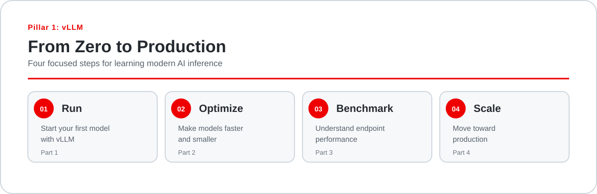

  <h1>vLLM Zero to Hero</h1>
  
<strong>Pillar 1: vLLM - From Zero to Production</strong>

  
Learn vLLM through four practical steps: run a model, make it more efficient, measure its performance, and scale the workload.

 

  

## Choose your next step

Each step has its own repository and hands-on tutorial. Open a repository to get started, then return here when you are ready for the next step.

| | Focus | What you will do | Next step |
| --- | --- | --- | --- |
| **01 - Run** | **Run your first model with vLLM** | Get a model running and learn the fundamentals of serving with vLLM. | [**Run your first model**](https://github.com/red-hat-ai-dev/vLLM-zero-to-hero-pt1) |
| **02 - Optimize** | **Make your models faster and smaller** | Use speculative decoding, quantization, and LLM Compressor to improve inference efficiency. | Coming soon |
| **03 - Benchmark** | **Know how your model actually performs** | Use GuideLLM to test throughput, latency, and serving performance before you scale. | Coming soon |
| **04 - Scale** | **Scale your inference workload** | Move from a single vLLM instance toward distributed serving with llm-d and Red Hat OpenShift AI. | Coming soon |

## Start with Part 1

Part 1 is the first hands-on experience in the series. You will:

- Run a model locally with vLLM
- Start an OpenAI-compatible API
- Send your first request
- See what is happening behind the scenes

[**Open the Part 1 repository**](https://github.com/red-hat-ai-dev/vLLM-zero-to-hero-pt1)

## Who this is for

This learning path is for anyone interested in learning how modern AI models are served with vLLM, whether you are exploring the topic for the first time or already working with inference systems.

- **Exploring AI infrastructure:** start with Part 1 and follow the repository README from top to bottom.
- **Already familiar with model serving:** use each repository as a focused hands-on guide.
- **Working toward production:** follow the steps in order to build context as you go.

## Questions or feedback

Found an issue or have an idea where you can contribute? [Open an issue in this repository](https://github.com/red-hat-ai-dev/vLLM-zero-to-hero-overview/issues)
