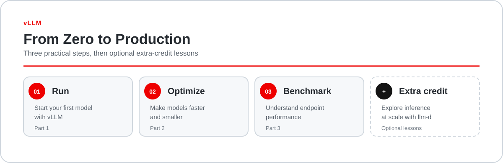

  <h1>vLLM Zero to Hero</h1>
  
<strong>vLLM: From Zero to Production</strong>

  
Learn vLLM through three practical steps: run a model, make it more efficient, and measure its performance. Then explore optional extra-credit lessons.

 

  

## Choose your next step

Each step has its own repository and hands-on tutorial. Open a repository to get started, then return here when you are ready for the next step.

| | Focus | What you will do | Next step |
| --- | --- | --- | --- |
| **01 - Run** | **Run your first model with vLLM** | Get a model running and learn the fundamentals of serving with vLLM. | [**Run your first model**](https://github.com/red-hat-ai-dev/vLLM-zero-to-hero-pt1) |
| **02 - Optimize** | **Make your models faster and smaller** | Use speculative decoding, quantization, and LLM Compressor to improve inference efficiency. | [**Optimize your model**](https://github.com/red-hat-ai-dev/vLLM-zero-to-hero-pt2) |
| **03 - Benchmark** | **Know how your model actually performs** | Use GuideLLM to measure throughput and latency, and lm-eval to compare accuracy. | [**Benchmark your model**](https://github.com/red-hat-ai-dev/vLLM-zero-to-hero-pt3) |

## Extra credit

Ready to explore more? [Extra credit](https://github.com/red-hat-ai-dev/vllm-zero-to-hero-extra-credit)
holds optional lessons, each in its own topic directory with a README and
supporting material. These are separate from the three core hands-on steps.

| Topic | What you will learn | Start here |
| --- | --- | --- |
| **Scale inference with llm-d** | Follow requests through inference-aware routing, cached prefixes, and separate prefill and decode workers. This visual explainer needs no cluster or multiple accelerators to follow. | [**Explore llm-d**](https://github.com/red-hat-ai-dev/vllm-zero-to-hero-extra-credit/tree/main/llm-d) |

## Who this is for

This learning path is for anyone interested in learning how modern AI models are served with vLLM, whether you are exploring the topic for the first time or already working with inference systems.

- **Exploring AI infrastructure:** start with Part 1 and follow the repository README from top to bottom.
- **Already familiar with model serving:** use each repository as a focused hands-on guide.
- **Working toward production:** follow the core steps in order, then use extra credit to explore distributed serving concepts.

## Questions or feedback

Found an issue or have an idea where you can contribute? [Open an issue in this repository](https://github.com/red-hat-ai-dev/vLLM-zero-to-hero-overview/issues)
